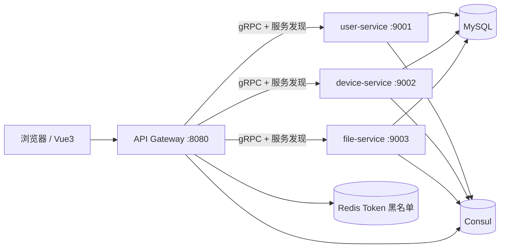

# 基于微服务的后台管理系统

这是一个可运行的课程设计项目，采用 B/S 架构：

- 前端：Vue3 + Vite + Element Plus + Axios + Pinia + Vue Router
- 后端：Go API Gateway + 3 个 Go 微服务
- 通信：网关对外提供 REST API，内部通过 gRPC 调用微服务
- 基础组件：MySQL + Redis + Consul
- 认证授权：JWT + RBAC

## 项目结构

```text
micro-admin-system/
├── backend/
│   ├── api-gateway/
│   ├── user-service/
│   ├── device-service/
│   ├── file-service/
│   ├── proto/
│   ├── common/
│   ├── scripts/
│   ├── docker-compose.yml
│   ├── go.work
│   └── README.md
├── frontend/
│   ├── package.json
│   ├── vite.config.js
│   └── src/
└── README.md
```

## 系统架构



## 快速启动

1. 启动基础组件：

```bash
cd backend
docker compose up -d
```

2. 启动后端微服务：

```bash
cd backend
go run ./user-service
go run ./device-service
go run ./file-service
go run ./api-gateway
```

实际运行时建议分别开 4 个终端。

3. 启动前端：

```bash
cd frontend
npm install
npm run dev
```

4. 浏览器访问：

```text
http://127.0.0.1:5173
```

默认账号密码：

```text
admin / admin123
```

## 数据库

初始化脚本：

```text
backend/scripts/init.sql
```

包含表：

- sys_user
- sys_role
- sys_menu
- sys_dept
- sys_user_role
- sys_role_menu
- device
- device_type
- file_info

管理员密码使用 bcrypt 保存，不是明文。

## gRPC

proto 文件：

- `backend/proto/user.proto`
- `backend/proto/device.proto`
- `backend/proto/file.proto`

Go 绑定代码：

- `backend/proto/gen`

## 接口文档

REST API 文档见：

```text
backend/API.md
```

## 并发设计体现

- 文件上传元数据保存后，file-service 使用 goroutine + channel 异步记录上传日志。
- device-service 统计接口使用多个 goroutine 并发查询总数、状态数量、类型数量，并通过 channel 汇总结果。
- 网关调用每个微服务时使用 `context.WithTimeout`，默认 3 秒超时。
- 每个微服务向 Consul 注册后，使用 goroutine 定时 TTL 健康上报。
- `scripts/seed.go` 使用 worker pool 批量生成 10000 条设备数据。

## 压测和造数

生成 10000 设备数据：

```bash
cd backend
go run ./scripts/seed.go
```

1000 用户请求压测：

```bash
cd backend
go test ./scripts -run TestPressure1000Users -count=1 -v
```

响应时间目标：小于 3 秒。实际结果和截图可填写在下表：

| 验收项 | 结果/截图位置 |
| --- | --- |
| 后端服务启动截图 | `docs/screenshots/backend.png` |
| 前端登录截图 | `docs/screenshots/login.png` |
| Dashboard 截图 | `docs/screenshots/dashboard.png` |
| 1000 并发压测结果 | 待填写 |
| 10000 设备生成结果 | 待填写 |

## 常见问题

如果 MySQL 初始化数据没有出现，通常是 Docker 数据卷已经存在。可以重置：

```bash
cd backend
docker compose down -v
docker compose up -d
```

如果前端请求 401，请重新登录；退出登录会将当前 Token 写入 Redis 黑名单。

如果网关提示发现服务失败，请打开 Consul UI 检查三个微服务是否已注册：

```text
http://127.0.0.1:8500
```
